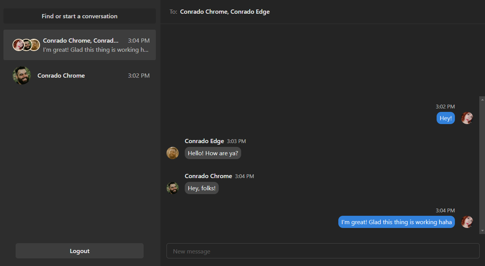

# iChatter

Demo: https://icevbot.netlify.app/

## About

Chat app with Next Auth Google sign in built w/ NextJS, Node, Express, GraphQL, MongoDB, Prisma, Chakra UI.

## Using npm

Run commands

1. `npm install`

2. `npm run dev`

Make sure you're running the server 1st.

## Or using yarn

Run commands

1. `npm install --global yarn`

2. `yarn install`

3. `yarn run dev`